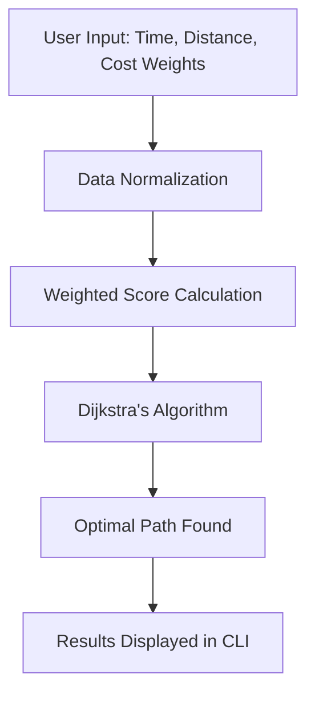

# 🗺️ Apex Pathfinder

A **logic-driven C++ recommendation engine** that determines the most *optimal travel route* by balancing a user’s unique weighted priorities for ⏱️ time, 📏 distance, and 💰 cost.

---

## 🚀 About The Project

Apex Pathfinder goes beyond simple shortest-path algorithms — it adapts to *what “best” means for you*. The engine calculates an **optimal route** by combining user preferences into a precise mathematical model, leveraging **Dijkstra’s Algorithm** enhanced with a **Weighted Sum Model** to handle real-world trade-offs between time, distance, and cost.

It demonstrates a deep understanding of:
- **Algorithmic Design:** Implementing Dijkstra’s algorithm in a multi-factor optimization environment.  
- **Problem Modeling:** Translating human preferences into a weighted mathematical model through data normalization.  
- **C++ Development:** Building a modular, efficient, and fully self-contained command-line application.  
- **Data Handling:** Parsing structured data from JSON and building an in-memory graph representation.  

---

## ⚙️ Technologies & Algorithms Used

- **Language:** C++ (C++17)  
- **Algorithm:** Dijkstra’s Algorithm  
- **Optimization Technique:** Weighted Sum Model  
- **Data Structures:** Adjacency List (`std::map`), Min-Priority Queue  
- **Data Format:** JSON (using [nlohmann/json](https://github.com/nlohmann/json))

---

## 🧩 System Overview



## 🛠️ How To Run
**Prerequisites**

A C++ compiler supporting C++17 (e.g., `g++`)

`json.hpp` from nlohmann/json
 placed in the project root

**Compilation**
```bash
g++ route_planner.cpp -o route_planner -std=c++17
```
**Execution**
```bash
./route_planner
```
## 🤝 Contributions

Contributions are welcome — feel free to open a pull request or share suggestions!
